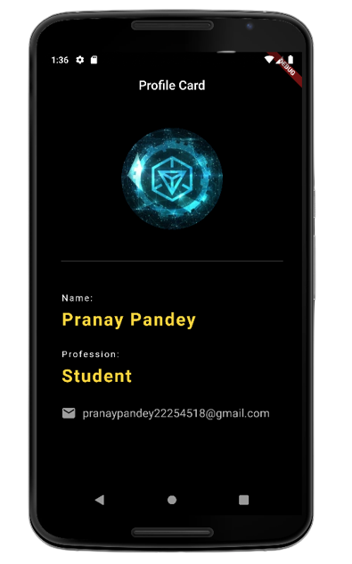

# Profile Card App

This is a simple profile card app that displays user information.

## Screenshots



## Getting Started

To get started with the app, follow the steps below.

### Prerequisites

- Make sure you have Flutter installed.

### Installation

1. Clone the repository.
2. Open the project in your preferred code editor.
3. Run the following command to get the required dependencies:

   ```bash
   flutter pub get
